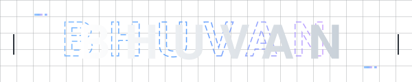

   
  
  
<b>Computer Science & Engineering Undergraduate</b>

  
<code>Cybersecurity</code>  •  <code>AI / ML</code>  •  <code>Full-Stack Systems</code>  •  <code>IoT</code>

   

   &nbsp;&nbsp;&nbsp;
   &nbsp;&nbsp;&nbsp;
  

    

  [About](#about-me)  •  [Projects](#featured-projects)  •  [Tech Stack](#tech-stack)  •  [Experience](#experience)  •  [Focus](#currently-building)  •  [Beyond Code](#beyond-code)
    

---

<h2 id="about-me">👤 About Me</h2>

I'm a Computer Science & Engineering undergraduate at RNSIT, Bengaluru, with a strong interest in building and understanding software systems. My primary interests lie in **Cybersecurity**, **AI/ML**, and **Full-Stack Engineering**, with growing interests in **Agentic AI**, **Systems**, **Networking**, and **IoT**. I enjoy exploring how these areas come together to create reliable and practical technology.

---

<h2 id="currently-building">🚧 Currently Building</h2>

> **Secure and intelligent systems across Cybersecurity, AI/ML, Agentic AI, and IoT.**

- 🤖 **Agentic AI**: Developing *PRAVAH (SIH26117)*, a sovereign on-premise AI workbench for confidential industrial workloads.
- 🎙️ **Intelligent Workflows**: Exploring LLM-powered workflows and real-time AI interaction through *ClinicDesk*.
- 🛡️ **Cybersecurity Engineering**: Building practical security systems spanning USB attack detection, IoT security, network telemetry, and anomaly detection.

---

<h2 id="featured-projects">⭐️ Featured Projects</h2>

> ### 🛡️ [SHIELD.USB](#)
> **USB attack detection & monitoring system**  
> Simulates and identifies potentially malicious USB/HID behavior using a Raspberry Pi Pico and a real-time monitoring dashboard.  
> `Python`  `Flask`  `React`  `InfluxDB`  `Raspberry Pi Pico`  
> *(Local / Work in Progress)*

 

> ### 🧠 [PRAVAH (SIH 26117)](https://github.com/bhuvan-sk/sih26117)
> **Sovereign on-premise agentic AI harness**  
> An industrial multi-agent workbench capable of handling complex SOP constraints with air-gapped sandboxing and LLM intent routing.  
> `Agentic AI`  `Python`  `LLMs`  
> [View Repository ➔](https://github.com/bhuvan-sk/sih26117)

 

> ### 🌐 [Arc](https://github.com/bhuvan-sk/arc)
> **Architecture explainer with Gemini Live**  
> AI architecture explainer that dissects system diagrams layer-by-layer (Data, API, Infra) and grounds responses in DDIA principles.  
> `FastAPI`  `React`  `Gemini Live`  
> [View Repository ➔](https://github.com/bhuvan-sk/arc)

 

> ### ☁️ [ClinicDesk](https://github.com/bhuvan-sk/clinic-desk)
> **Cloud-synchronized clinic platform**  
> Full-stack clinical management platform featuring real-time data sync, secure Supabase RLS, and a GenAI voice assistant.  
> `React`  `Supabase`  `Node.js`  
> [View Repository ➔](https://github.com/bhuvan-sk/clinic-desk)

---

<h2 id="project-navigation">🧭 Project Categories</h2>

**Cybersecurity**
*   **[CHRONOS](#)** — Agentless IoT network monitoring via packet IAT telemetry.

**Full-Stack & Systems**
*   **[Alumni_Dash](https://github.com/bhuvan-sk/alumni-dash)** — RNSIT Institutional Intelligence Platform with admin RLS.

**IoT / Embedded**
*   **[IoT Dashboard](https://github.com/bhuvan-sk/iot)** — Real-time ESP32 home automation via low-latency WebSockets.
*   **[AegisFlow](https://github.com/bhuvan-sk/AegisFlow_ESP32_Upgraded)** — Gas & temperature MQTT telemetry with dynamic risk-score calculation.

---

<h2 id="tech-stack">⚙️ Tech Stack</h2>

### Languages
   

### Full Stack
   

### Databases & Data
  

### AI / ML
`Machine Learning`  `LLMs`  `Agentic AI`  `Isolation Forest`

### Cybersecurity
`Network Security`  `IoT Security`  `Threat Detection`  `OWASP`

### Systems / IoT
`ESP32`  `Raspberry Pi`  `MQTT`  `WebSockets`

---

<h2 id="experience">🏆 Experience & Project Highlights</h2>

### PRAVAH — Sovereign AI Workbench
Working on an on-premise agentic AI architecture designed for confidential industrial environments, with emphasis on open-weight multimodal models, secure execution, and controlled AI workflows.

### Chronos — IoT Security
Developed an agentless IoT security approach using network timing telemetry and anomaly detection to identify suspicious behavior without requiring changes to monitored devices.

### SHIELD.USB — USB Security
Built a USB attack detection and monitoring system combining microcontroller-based attack simulation, device tracking, backend APIs, telemetry, and dashboard visualization.

### ClinicDesk — AI-Powered Full-Stack System
Built a full-stack clinical management application integrating real-time task management, synchronization, and AI-powered voice interaction.

### RNSIT Alumni Initiative — Social Media Intern
Working on digital communication and social media initiatives for the RNSIT alumni network.

---

<h2 id="beyond-code">🏔️ Beyond Code</h2>

Outside of the terminal, I balance my screen time with:  
`Running`  •  `Trekking`  •  `Cricket`  •  `Photography`

 

  
<i>Built with curiosity, caffeine, and too many terminals.</i>

  <a href="https://linkedin.com/in/bhuvan-sk">LinkedIn</a>  • 
  <a href="https://github.com/bhuvan-sk">GitHub</a>  • 
  <a href="mailto:bhuvi.perfect@gmail.com">Email</a>

